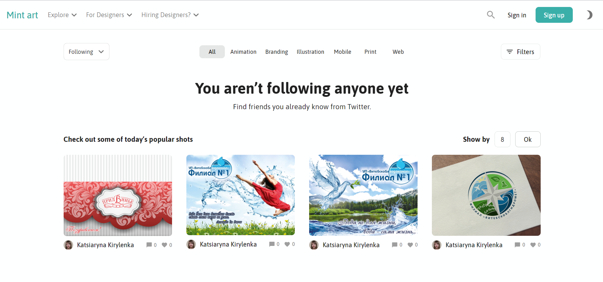
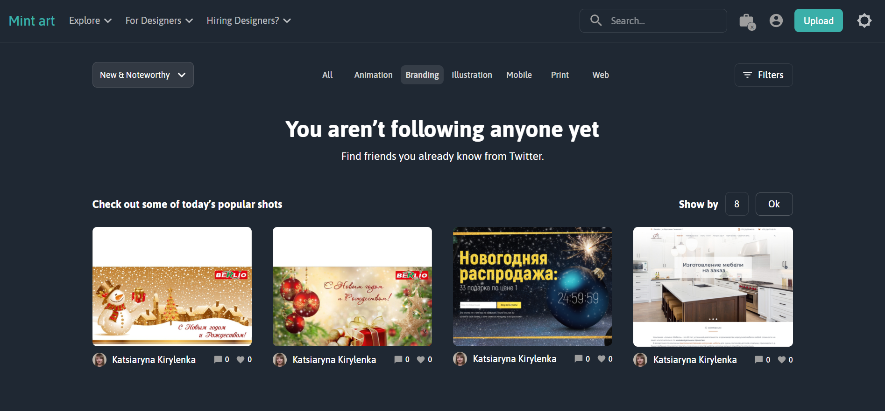
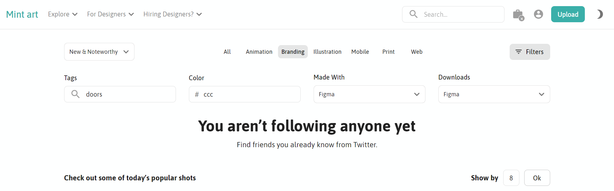
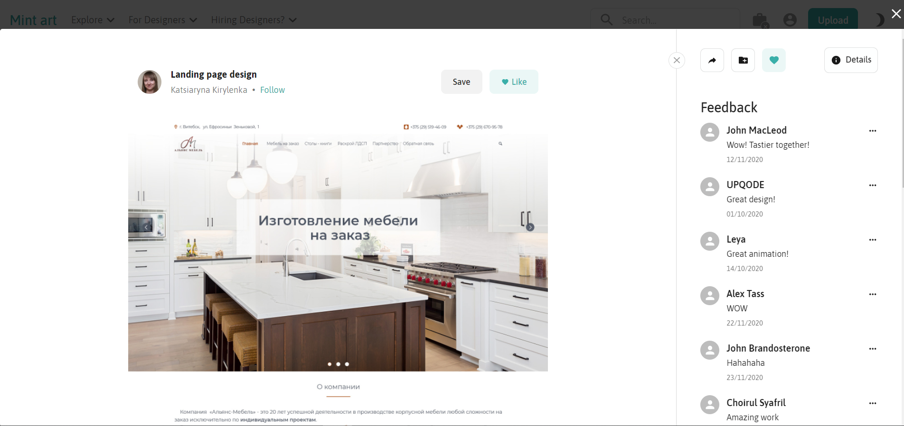

# Mint-art

Mint-art is a huge portfolio of projects and personal illustrations in graphics, packaging design, animation, and just about every design industry you can think of.

## [Live demo](https://mint-art.netlify.app/)

## Description

The site uses the Dribbble API. The project used the following libraries: React, Redux, Redux-Saga and Material UI.

Currently the site has one main page:



The site has the following settings:

- light / dark theme



- shot filtering panel
- you can set the number of displayed shots on the page
- pagination



Also, by clicking on any shot, a modal window with detailed information opens:



## Project setup

```
yarn install
yarn start
```
